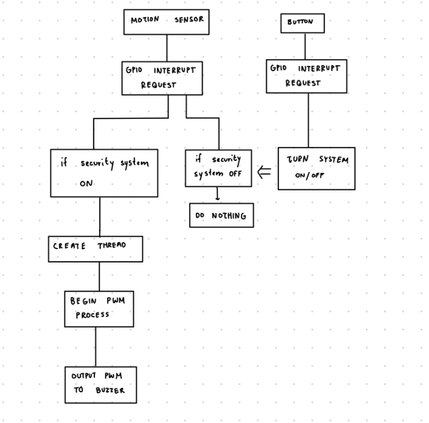
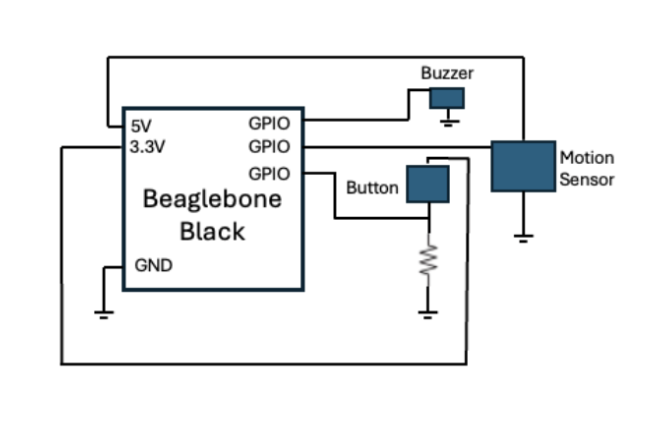

# Beaglebone Home Security System

Course: EC535 – Embedded Systems  
Contributors: Abigail Skerker, Cristian Palencia  
Platform: Beaglebone Black  
Kernel Module Language: C  
Demo Video: [YouTube](https://youtu.be/EEVpLaNmyOU)  
Source Code: [GitHub Repository](https://github.com/cpalencica/SecuritySystem)

---

## Project Overview

This project implements a simple home security system on a Beaglebone Black using a custom Linux kernel module. The system detects motion using a PIR sensor and triggers a buzzer alarm if motion is detected while the system is active. A pushbutton toggles the active mode. The buzzer is controlled via software-emulated PWM using kernel threads.

---

## Components Used

- Beaglebone Black
- HC-SR501 PIR Motion Sensor
- Pushbutton
- Buzzer
- Linux Kernel Module (written in C)

---

## System Architecture

> Figure 1: High-Level System Diagram
>
> 

- The motion sensor triggers an interrupt when motion is detected.
- A pushbutton toggles system mode (armed/disarmed).
- A kernel timer and kernel thread handle buzzer behavior and PWM output.

---

## Kernel Module Overview
- Initialization: GPIOs are requested and configured; interrupts are registered; character device is initialized.
- Interrupts:
  - Motion sensor ISR triggers a 5-second buzzer alert if system is active.
  - Pushbutton ISR toggles the active/inactive system mode.
- PWM Generation: A kernel thread toggles the buzzer pin using `udelay()` to simulate PWM (~2 kHz).
- Character Device: Provides read access for user-space applications to see system status (active timers, system mode).

---

## File Descriptions

| File | Description |
|------|-------------|
| `security.c` | Main kernel module containing device logic |
| `Makefile` | Build script for kernel module |

---
## Hardware Setup

> Figure 2: Circuit Diagram  
> 

This project uses the following hardware components connected as described below:

- **Beaglebone Black**: Acts as the main controller running the Linux kernel module.
- **PIR Motion Sensor (HC-SR501)**: Connected to a GPIO pin configured to trigger interrupts when motion is detected. It requires 5V power and ground.
- **Pushbutton**: Connected to a GPIO input pin with an appropriate pull-up or pull-down resistor to detect user toggling between "armed" and "disarmed" system modes.
- **Buzzer**: Connected to a GPIO output pin. Controlled via software PWM generated in the kernel module to produce an audible alarm.

### Wiring Summary

| Component       | Beaglebone Pin          | Notes                            |
|-----------------|-------------------------|---------------------------------|
| PIR Sensor VCC  | 5V                      | Power supply                    |
| PIR Sensor GND  | GND                     | Ground                         |
| PIR Sensor OUT  | GPIO                    | Interrupt input from sensor    |
| Pushbutton      | GPIO                    | Input with pull-up/pull-down   |
| Buzzer          | GPIO                    | PWM output to buzzer           |

---

## Major Code Components

### 1. Interrupt Handling
```c
sensor_irq = gpio_to_irq(sensor_pin);
request_irq(sensor_irq, sensor_irq_handler, IRQF_TRIGGER_RISING, ...);
```

- Motion sensor generates a rising-edge interrupt.
- Calls sensor_irq_handler() which activates the buzzer.

### 2. Pushbutton Toggle
```c
response0 = gpio_request(button_pin, "sysfs");
request_irq(gpio_to_irq(button_pin), button_irq_handler, ...);
```

- Toggled between "armed" and "disarmed" mode.

### 3. Kernel Timer and kthread
```c
etx_timer = kmalloc(...);
timer_setup(etx_timer, buzzer_timer_callback, 0);
```

- Starts a 5-second countdown after motion is detected.
- Buzzer is stopped when timer expires.

### 4. Software PWM Thread

``` c
buzzer_thread = kthread_run(pwm_thread_function, NULL, ...);
``` 

- Controls duty cycle by toggling the buzzer pin in a loop using udelay().

--- 
## PWM Thread

The software PWM thread generates a PWM signal on the buzzer GPIO pin by toggling the pin state at a fixed frequency to create a square wave. This approach simulates hardware PWM using precise timing in software.

### Functionality

- The thread continuously toggles the buzzer GPIO pin HIGH and LOW.
- The duration of the HIGH and LOW states are equal, resulting in a 50% duty cycle square wave.
- The toggling frequency is controlled by the defined `PWM_FREQUENCY`.

### Operation Details

- The period of one full PWM cycle is calculated in microseconds as `1,000,000 / PWM_FREQUENCY`.
- Since the duty cycle is 50%, the period is divided into two equal halves: `half_period_us`.
- The GPIO pin is set HIGH for `half_period_us` microseconds, then set LOW for `half_period_us` microseconds.
- This toggling continues in a loop until the thread is signaled to stop.

### Thread Loop Workflow

1. Calculate the PWM period and half-period based on `PWM_FREQUENCY`.
2. Set the buzzer GPIO pin HIGH.
3. Delay for the half-period using `udelay()` to achieve microsecond-level timing.
4. Set the buzzer GPIO pin LOW.
5. Delay again for the half-period.
6. Repeat until `kthread_should_stop()` returns true, signaling thread termination.

### Code Snippet:

```c
static int PWMtoggle(void *data) {
    unsigned int period_us = 1000000 / PWM_FREQUENCY; // Period in microseconds
    unsigned int half_period_us = period_us / 2;      // Half period in microseconds

    while(!kthread_should_stop()) {
        gpio_set_value(BUZZER, 1);  // Set buzzer ON
        udelay(half_period_us);      // Wait half period

        gpio_set_value(BUZZER, 0);  // Set buzzer OFF
        udelay(half_period_us);      // Wait half period
    }

    return 0;
}
```

---
## Build & Run Instructions
```bash
# Compile
make

# Load module (as root)
sudo insmod home_security.ko

# Check kernel logs
dmesg | tail -n 20

# Read system status
cat /dev/home_security

# Unload
sudo rmmod home_security
```

---
## Figures
- Figure 1: High-level system block diagram
- Figure 2: Circuit Diagram
- Figure 3: Real-life Circuit

---

## Demo Video
Watch the system in action: https://youtu.be/EEVpLaNmyOU